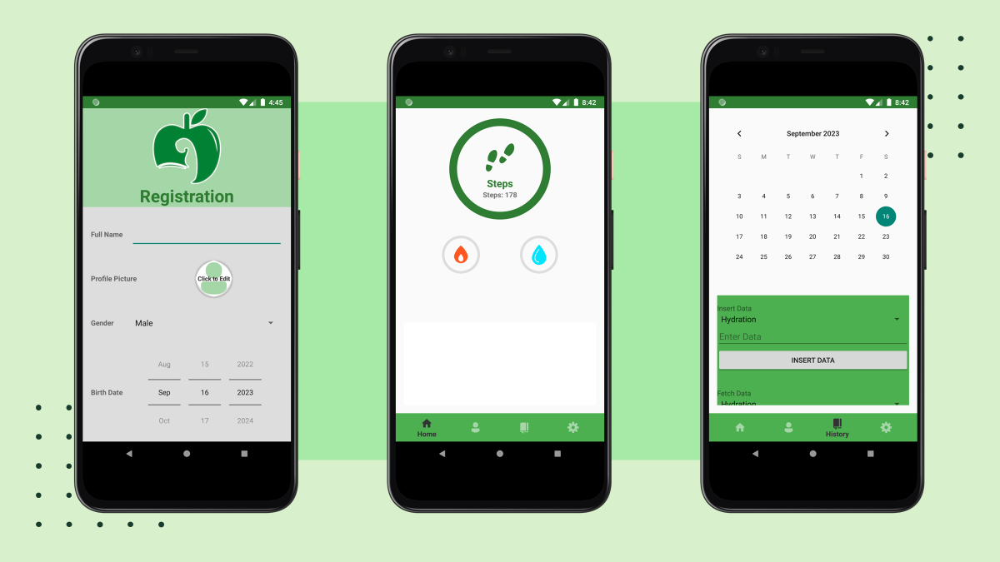

# **HealthCoach: An Android Application for Enhancing Physical Health**

## Overview

HealthCoach is an Android application designed to enhance physical health. It allows users to record their steps and activity data using smartphone sensors, as well as manually input other data such as water intake and weight. The app is based on the Google Fit platform.

## Screenshots

## Features

- **Automatic Step Tracking:** The number of steps taken during the day is automatically recorded.
- **Personalized Goals:** Users can set personalized goals and track their progress.
- **Insightful Analytics:** Users can have an overview of their habits through customized graphs.
- **Various Physical Activities:** Users can record different types of physical activities within the app.

## Technologies Used

- **Android Language (Java):** Development of the app is carried out using Java with the Android Software Development Kit.
- **Google Fit Platform and API:** Integrated to track physical activity and collect health data.
- **Firebase Services:** Utilized for various functionalities including:
  - **Firebase Authentication:** Firebase is used for user authentication, supporting login with email/password or Google account credentials.
  - **Firebase Realtime Database:** Firebase Realtime Database stores JSON data about the user, ensuring data integrity and security. This data cannot be manipulated with the Google Fit API.
  - **Firebase Storage:** Firebase Storage is utilized for storing user profile pictures.
- **AnyChart:** Used for generating customizable and interactive charts to visualize data.
- **Glide:** Employed for efficient image loading and caching within the app.

## Getting Started
1. Clone the repository: `git clone https://github.com/your_username/HealthCoach.git`
2. Open the project in Android Studio.
3. Run the app on an emulator or physical device.

## Contact
For questions or support, contact [Luigi Iorio](mailto:luigi.iorio.dev@gmail.com).
